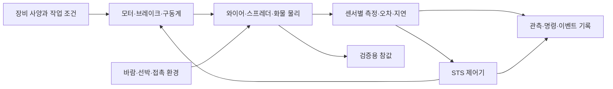

# STS 코드 확장 계획과 추가 적용 기능

작성일: 2026-09-23. 기준: `junsoo` / `13e007e` 및 [도면·센서 분석](README.md), [참고 데이터](STS_ReferenceData.json).

이 문서는 구현 전 기준으로 개발 범위와 순서를 정리한 계획이다. 이후 적용한 프로파일·자동 운반·관측·시간 기록의 실제 범위는 [런타임 적용 안내](RuntimeApplication.md)를 따른다. 아래 표의 현재 상태와 신규 타입 명칭은 계획 당시 기준이며, 모든 후보가 구현되었다는 의미는 아니다. 도면 판독값, 일반 센서 사례, 프로젝트 설계 제안을 구분하며 원본에 없는 수치는 확정값으로 채우지 않는다.

## 1. 개발 목표

**PortSim의 최종 목표는 선박 -> STS -> AGV -> 야드크레인 -> 야드 적재를 자동화하고, 전체 작업의 시간 이득을 계산하는 것이다.**

현재 STS 개발의 목표는 **장비 사양·물리 변수·센서 관측을 실제 동작과 판단에 반영하여, 선박의 컨테이너를 자동으로 집어 AGV에 인계하고 다음 작업을 수행하는 것**이다. 수집한 변수는 자동 운반을 성립시키는 입력과 제약이다. 변수별 결과 비교나 제어기 ON/OFF 실험은 개발 검증을 위한 보조 수단이며 제품의 주된 목표가 아니다.

예를 들어 컨테이너 질량은 허용 권상 속도·하중 판단에, 트롤리 속도/가속도는 이동 궤적과 소요 시간에, 잠금 센서는 인양 시작 허가에, 흔들림·정렬 정보는 이동 보정과 착지 시점에 반영한다. 자동화 제어기가 이 조건을 읽고 명령과 상태 전이를 결정해야 한다. 결과는 실제로 완료된 자동 운반과 그 과정에서 발생한 작업·대기 시간이다.

센서 시각 표시만 추가해서 하중 계산이 생기는 것은 아니다. 실제 하중 계산 또는 명시적으로 가정한 모델을 먼저 마련하고 센서가 이를 관측하게 한다. 정확한 실장비 값이 없는 항목은 별도 가정 프로파일을 통해 실험할 수 있지만 검증된 실장비 모델과 구별한다.

## 2. 현재 코드를 확장해야 할 작업

경로는 저장소 루트 기준이다. P0는 변수를 반영한 자동 인양·인계 및 시간 기록, P1은 자동 운반의 안정성과 처리 효율, P2는 상세 모델과 부가기능이다. 세부 물리 모델의 정밀도는 자동 운반 동작과 시간 산정에 필요한 수준부터 높인다.

| ID / 우선순위 | 현재 상태 | 코드 확장 | 주요 연결 위치 | 완료 기준 |
|---|---|---|---|---|
| W01 / P0 | 치수·속도·질량이 상수, JSON은 문서용 | 장비 프로파일·검증기·선택적 임포터. 단위, 출처, 확인 여부, 가정값 분리 | `QuayCrane.h`, `BuildTerminal`, 신규 프로파일 | 미확정값을 0으로 처리하지 않고 누락 항목을 표시. 초기화가 프로파일 값을 덮어쓰지 않음 |
| W02 / P0 | 단순 박스 구조, 30m 빔·17m 레일 간격 | 도면 기반 구조 치수와 해측/육측 작업 범위, 장비 로컬 좌표, 센서 부착 프레임 | `QuayCrane.cpp` 생성자, `TerminalLayout.h`, 선박/AGV 인계 좌표 | 레일 30.48m, outreach 63.5m 등 확인값 반영. 인양 높이와 로프 길이를 별도 검증 |
| W03 / P0 | 트롤리·갠트리 속도가 결합, 권상 속도 고정 | 각 구동축의 속도·가감속·저크·브레이크 분리, 하중별 권상 속도 곡선 | `Tick`, `SetDriveInput`, `DriveSpreaderTo` | 240/60m/min 트롤리/갠트리 조건 독립 적용. 빈 스프레더와 유부하 속도 구분 |
| W04 / P0 기본·P2 상세 | 위치를 직접 갱신, 모터 토크 모델 없음 | 우선 부하별 속도·가감속·제동 제약을 구동에 반영. 상세 자료 확보 후 토크·감속기·드럼 모델 연결 | 신규 구동 모델, `QuayCrane.cpp` | 적용한 구동 한계가 자동 운반 궤적과 소요 시간에 영향을 줌. 상세 토크 해석 완성을 전체 자동화의 선행 조건으로 삼지 않음 |
| W05 / P0 기본·P2 상세 | 시각 와이어 4개 + 단일 서스펜션 제약, 회전 잠금 | 질량·무게중심·현수 길이·흔들림·접촉을 자동 인양/착지에 연결. 자료 확보 후 줄걸이·개별 장력 정밀화 | `Suspension`, `UpdateRopes`, `PortContainerActor` | 물리 상태가 이동 보정·안정화·착지 판단에 반영됨. 추정한 하중과 검증된 개별 반력을 구분 |
| W06 / P0 | 위치/속도 참값을 직접 읽음 | 센서 공통 인터페이스와 장착 프레임. 엔코더·4코너 하중·잠금·착좌·AGV 위치부터 구현 | 신규 센서 모듈, `TerminalAutomation.cpp` | 참값/관측값 분리, 시각·유효성·오차·지연·고장 주입, 모서리 채널 매핑 |
| W07 / P0 | 단일 잠금 bool, 거리 검사 후 결합 | 코너별 잠금 상태, 잠금 명령/응답, 빈/적재 상태별 인양 허가, 착좌·하중·리미트 검사 | `ToggleLock`, 자동화 상태 전이 | 코너 하나 실패 시 적재 인양 거부. 빈 스프레더 상승은 적재 잠금 조건과 분리 |
| W08 / P0 | AGV/RMG 보유 중 화물 물리 해제·위치 추종 | 인계 구역 접촉·지지 확인, 해제 허가, 장비 간 작업/점유 확인 | `TerminalFleet.cpp`, AGV/RMG 액터 | 화물 지지·잠금 해제·스프레더 이탈 순서를 확인. 인계 순간 위치/하중 불연속 점검 |
| W09 / P0 | 큰 재생 배속에서 엔진 delta 확대, 제어는 프레임 기반 | 물리/센서/제어의 시뮬레이션 시간 계약, 일정 주기 실행·이벤트 기록 | `PortSimTimeStep`, `Tick`, 신규 제어기 | 배속별 결과 편차 측정. 엔진 물리 서브스텝과 중복 적분하지 않음 |
| W10 / P1 | 부호 없는 총 흔들림 각, 회전 잠금 | 자동 운반 경로에서 sway/skew 관측에 따라 움직임을 보정하고 착지 가능 상태 확보 | `GetSwayDegrees`, 서스펜션, 신규 제어기 | 적용된 제어가 안정된 자동 인계로 이어짐. ON/OFF 비교는 검증 도구로 사용 |
| W11 / P0 기록·P2 상세 화면 | HUD와 CSV가 진행 상태 중심 | 작업/상태 진입·종료·대기 사유·AGV 인계·다음 작업 가능 시각 기록. 상세 하중/센서 화면은 진단용 | `APortSimHUD`, `ResultsCsv` | 자동 처리량, 단계별 소요 시간, 대기 시간, 전체 완료 시간을 재구성 가능 |

W04-W05는 확보한 사양과 명시한 가정을 반영한 유효 모델로 시작한다. **실제 모터 부하·각 와이어 장력의 정량 검증**은 추가 상세 자료가 들어오면 진행한다. 기존 단일 제약의 반력을 실제 와이어별 장력이나 4코너 반력으로 그대로 나누지 않는다. 센서 값과 제한을 표시하는 데 그치지 않고 자동 운반 명령과 상태 전이에 연결한다.

## 3. 권장 코드 책임 분리

처음부터 모든 기능을 새 액터로 옮길 필요는 없다. 기존 `AQuayCrane`을 유지하면서 아래 책임을 순서대로 분리한다. 아래 명칭은 신규 타입 제안이며 구현 파일이 아니다.

| 제안 타입/모듈 | 담당 | 입력/출력 |
|---|---|---|
| `USTSCraneProfile` | 기하·작업범위·구동 사양·센서 구성·출처 | 프로파일 + 누락/가정 목록 |
| `FSTSDriveModel` | 구동축별 모터·감속기·브레이크·제한 | 명령/반력 -> 구동 상태/힘·토크 |
| `USTSSuspensionComponent` | 로프·스프레더·화물 연결 및 관측 가능한 물리 상태 | 구동·환경 -> 자세/장력/반력 |
| `USTSSensorComponent` | 센서별 장착 위치, 샘플링·오차·고장 | 참값 -> 관측 메시지 |
| `USTSControllerComponent` | 상태 전이·명령 허가·위치 제어·sway/skew 제어 | 관측/작업 -> 구동/잠금 명령 및 사유 |
| `FSTSObservationFrame` | 동일 시점의 유효한 관측 묶음 | 시뮬레이션 시각, 채널 값, 유효성, 데이터 나이 |
| `FSTSTelemetryFrame` | 실험 재현과 HUD/CSV 공통 데이터 | 참값·관측·명령·프로파일 ID·상태·고장 |

프로파일은 Unreal DataAsset 기반으로 편집하고, 필요한 경우 JSON 임포터를 붙이는 안을 우선 제안한다. 참고 JSON 전체를 그대로 실행 설정으로 삼지 않고 확정/가정 값을 명시적으로 선택하는 변환 단계를 둔다. JSON 임포터를 구현하는 경우에만 필요한 JSON 관련 빌드 의존성을 추가한다.

물리 상태를 갱신하는 주체는 하나여야 한다. Chaos가 적분하는 물체에 별도 수치 모델이 위치를 강제로 덮어쓰는 방식은 피한다. 운동학 모드와 동역학 모드를 함께 제공한다면 상호 배타적으로 선택하고, 결과 로그에도 선택한 모델과 가정을 남긴다.

## 4. STS에 추가 적용할 수 있는 기능

아래는 **이 프로젝트의 확장 후보**다. 자동 운반에 직접 필요한 정렬·경로·흔들림 제어와 장비 간 인계 기능을 우선한다. 센서 시각화·에너지 분석·VR·정비 기능은 후순위다. 표의 단계는 후보별 기술 선행 관계이며 모두를 구현해야 STS가 완료된다는 뜻은 아니다. 이 ZPMC 장비에 실제 탑재되어 있다는 의미도 아니다. STS의 선박 적층 프로파일, 차량 위치 정렬, 붐/갠트리 충돌방지, trim/list/skew, anti-snag, 회생전력은 제조사 공개 기능 사례에서도 확인된다. [Liebherr STS 제품 설명](https://www.liebherr.com/en-za/maritime-cranes/products/port-equipment/ship-to-shore-container-cranes-6294825)

| 추가 기능 | 시뮬레이터에서 구현할 내용 | 추가 입력/선행 작업 | 단계 |
|---|---|---|---|
| 센서 부착·검출 범위 시각화 | 센서 클릭 시 위치·방향·범위·측정값·오차 표시, LiDAR 가림/사각 확인 | 상세 장착 좌표가 없으면 가상 배치로 표시 | 1 |
| 연착지·자동 정렬 | 거리·상대속도에 따른 저속 하강, 코너 정렬과 착지 충격 비교 | 접촉 모델, 상대 자세, 허용 오차 | 2 |
| 편하중·무게중심 추정 | 코너 하중으로 편심 표시, 인양 전후 값 비교 | 센서 보정·준정적 판정·지지점 좌표 | 2 |
| Anti-snag / 느슨한 로프 검출 | 셀가이드 등에 걸림, 장력 급증, 로프 이완 시나리오와 제어 반응 | 로프·접촉 모델, 감지 조건·브레이크 정책 | 2 |
| 풍향·돌풍 영향 | 화물 외력과 sway/skew 변화, 운전 제한, 보관 상태 시나리오 | 항력/면적·풍속 한계·정지 절차; 풍속계와 외력을 분리 | 2 |
| 선박 프로파일·경로 생성 | 경로 구간의 장애물과 화물 외형을 포함해 안전 높이 선택 | 스캐너/지도, 화물 크기·흔들림 여유·감속 거리 | 2 |
| Trim/List/Skew 자세 정렬 | 기울어진 목표 면 또는 AGV 방향에 스프레더 자세 맞춤 | 실제 자세 조정 기구와 관측. Anti-skew와 목표 자세 제어를 구분 | 3 |
| 붐 상승·하강과 Catenary trolley | 작업/보관 상태, 붐 이동, 로프 지지 트롤리의 연동 | 힌지 좌표·각도·줄걸이·동기화. 도면의 6분은 전체 시간만 제공 | 3 |
| 신축 스프레더·Twin-lift | 20/40/45ft 전환, 2x20 감지, 각 화물의 체결/하중 분리 | 실제 스프레더 모델·잠금 수·용량·신축 기구 | 3 |
| 에너지·회생 제동 | 축별 기계 일, 전력 소비·회생 에너지와 작업당 에너지 비교 | 모터/인버터 효율, 회생 가능 여부, 전기 모델 | 3 |
| 복수 STS 작업 구역 | 크레인 간 접근·붐/화물 간섭, 인계 차로 예약, 대기 원인 표시 | 복수 액터, 공유 구역 관리자, 정지 거리 | 3 |
| 원격 조작·VR 운전석 | 조이스틱/수동·보조·자동 모드, 카메라와 센서 화면, 조작 인계 | 입력 장치/VR 사양, 운전 권한·모드 전환 조건 | 3 |
| 고장 주입·교육 시나리오 | 로드셀 편향, 엔코더 드리프트, 잠금 실패, 통신 지연·영상 손실 | 센서/구동 고장 모델, 재현 가능한 난수 seed | 1-2 |
| 상태감시·정비 기록 | 동작 시간, 권상 횟수, 고장 이력, 장력·온도 추세 표시 | 온도/마모는 별도 모델 필요. 데이터 없이 잔여 수명 단정 금지 | 3 |
| 선박 운동·조위 변화 | 화물 목표 높이/자세가 변할 때 접근·착좌 평가 | 계류 선박 운동/조위 입력. 해양 크레인용 heave compensation을 STS 기본 기능으로 가정하지 않음 | 3 |

느슨한 로프·걸림·충격 하중 방지 개념의 산업용 크레인 사례는 [Konecranes Smart Features](https://www.konecranes.com/sites/default/files/2022-03/SMARTON_crane_brochure_en_Konecranes_2020.pdf)를 참고했다. 이는 산업용 크레인 기능 사례이며 대상 STS의 임계값·설치 증거가 아니다. 알고리즘과 적용 조건은 프로젝트에서 별도로 정의한다.

## 5. 먼저 만들 범위와 완료 순서

### M1. 장비 프로파일과 기존 동작 연결

W01-W03 및 W11의 기본 표시를 구현한다. 형상 치수·좌표·독립 속도 제한과 부하별 권상 조건을 연결한다. `65LT` 정의가 미확정인 동안 kg 부하 선택에는 명시한 실험 프로파일이 필요하다. 시험 조건, 확정/가정 값을 HUD와 로그에서 구분한다. 기존 인양·인계 동작이 계속 가능한지 확인한다.

### M2. 변수를 반영한 자동 집기·인양·이동

W04-W07의 기본 모델을 자동 작업 흐름에 연결한다. 작업 명령을 받으면 접근 -> 착좌 -> 잠금 확인 -> 부하 조건에 맞춘 인양 -> 허용 경로 이동을 자동으로 수행한다. 질량·구동 제한·현수 상태와 센서 관측이 실제 명령과 상태 전이를 결정해야 한다. 필요한 제어를 적용하며 단계별 시간을 기록한다. 상세 하중 패널 제작을 이 단계의 완료 조건으로 삼지 않는다.

### M3. 관측에 근거한 STS -> AGV 인계

W06-W09를 완성한다. AGV 도착/정차/정렬을 확인하고, 하강 -> 지지 확인 -> 잠금 해제 -> 스프레더 이탈 -> AGV 출발 허가 -> 다음 작업으로 진행한다. AGV 대기 사유와 시간을 구분한다. 여러 컨테이너를 수동 개입 없이 반복 인계하고, 적용한 변수와 작업/대기 시간 기록이 확보되면 첫 STS 자동 운반 범위를 완료한 것으로 본다. 고장 시나리오는 이 흐름을 검증하는 보조 항목이다.

### M4. 자동 운반의 안정성과 처리 효율 개선

W10과 필요한 외란·경로 제어를 자동 운반에 적용한다. 흔들림 보정·정렬·접근 속도 조절을 통해 안정적인 착지와 불필요한 재시도/대기 감소를 달성한다. 제어기 ON/OFF나 변수 변화 실험은 회귀 검증용으로 두고, 주 결과는 반복 자동 인계 성공과 실제로 발생한 작업시간이다.

### M5. 선박에서 야드까지 통합 자동화와 시간 이득 계산

STS 완료/인계 이벤트를 AGV 운반과 야드크레인 적재에 연결하고, 공통 작업 ID와 시뮬레이션 시각으로 전체 완료 시간을 집계한다. 장비별 물리 모델은 이 자동화 과정과 시간 산정에 필요한 수준으로 확장한다. 붐 보관 동작·twin-lift·에너지·VR 등의 부가기능은 통합 자동화보다 앞선 필수 조건으로 두지 않는다.

### 시간 이득의 산정 기준

- STS 기록: 작업 배정, 접근, 착좌/잠금, 인양, 수평 이동, AGV 대기, 하강/해제, 인계 완료, 다음 작업 가능 시각. 상태 구간을 중복 집계하지 않는다.
- 항만 전체 기록: 동일 작업 묶음의 시작부터 마지막 컨테이너의 야드 적재 완료까지의 시뮬레이션 시간, 처리량, 장비별 작업/대기 시간.
- STS·AGV·야드크레인은 병렬로 움직일 수 있으므로 각 장비 시간을 단순 합산해 전체 소요 시간으로 사용하지 않는다. 전체 이벤트 시각과 장비 간 대기 관계로 산정한다.
- 시간 이득은 `기준 운용 총시간 - 자동화 운용 총시간`, 절감률은 `시간 이득 / 기준 운용 총시간 * 100`으로 계산한다. 기준 운용이 수동인지 기존 운용 방식인지는 아직 정하지 않았다. 동일 화물·배치·장비 자원·완료 조건을 사용한다.
- 렌더링 FPS, 컴퓨터 실행 시간, 재생 배속으로 빨라진 화면 시간을 물류 자동화의 시간 이득으로 계산하지 않는다.

## 6. 공통 기록값과 검증 기준

- 장비·작업: 프로파일 ID/버전, 사용 가정, 컨테이너 ID/질량/무게중심, 작업 상태, 제어 모드.
- 물리: 축별 위치/속도/가속도, 모터 토크/회전수, 와이어별 장력, 코너별 반력, sway X/Y·yaw와 각속도, 접촉/지지 상태.
- 센서: 참값과 측정값, 샘플 시각·지연·유효성·고장 코드. 제어 로직의 참값 우회 금지.
- 명령: 위치/속도/토크 목표, 제한에 걸린 이유, 잠금/해제 허가, 정지·복구 이벤트.
- 주 결과: 자동 인계/야드 적재 완료 수, 전체 완료 시간, 처리량, STS 단계별 작업·대기·재시도 시간, 기준 운용 대비 시간 이득.
- 보조 검증: 흔들림·회전, 장력·코너 불균형, 인계 오차. 에너지는 모델을 제공하는 경우의 선택 항목이다.
- 검증: 단위/좌표와 프로파일 로드, 정적 평형·동적 응답, 고장 시 상태 전이, 배속별 결과 차이. 임계값·허용 오차는 사양 또는 명시된 실험 기준으로 결정한다.

우선 확보할 추가 자료는 LT 정의, 자중·관성·무게중심, 줄걸이 상세도, 감속비·드럼 반경, 토크/속도·브레이크 특성, 센서 배치/PLC I/O, 실제 sway/skew 구동 방식이다. 이것들이 없더라도 인터페이스와 실험용 모델은 만들 수 있지만 정량 결과의 적용 범위는 해당 가정으로 제한된다.
